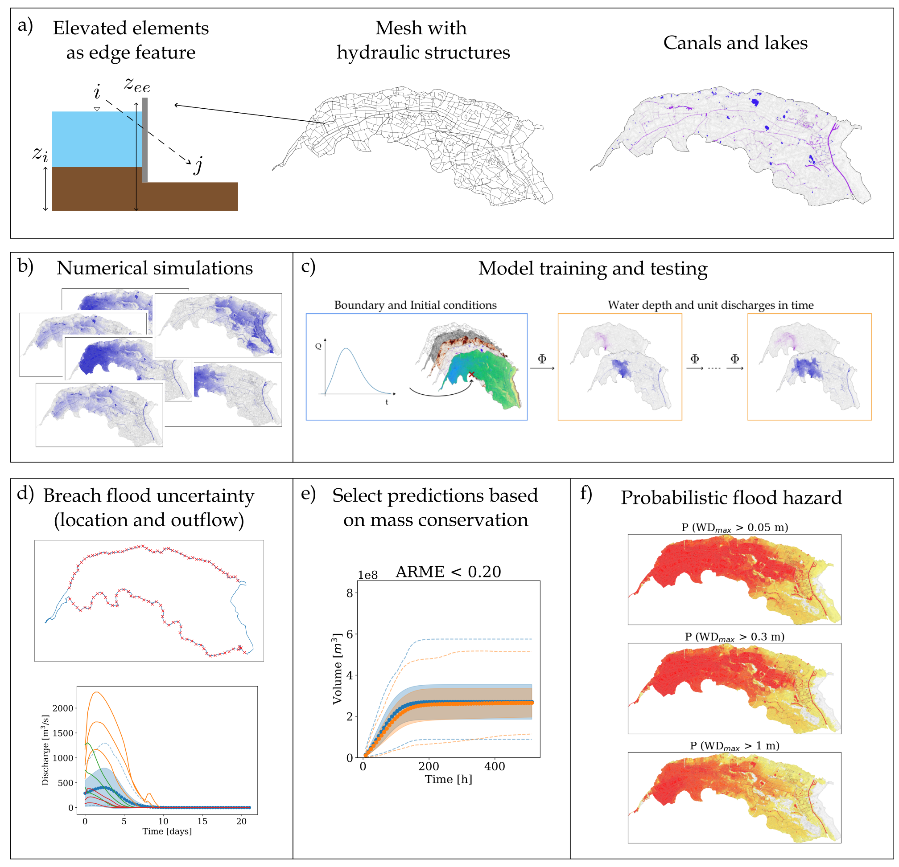

# mSWE-GNN (Repository for paper "Probabilistic flood hazard mapping for dike-breach floods via graph neural networks")
(Version 1.2 - Apr. 8th, 2026)

## Overview

The dataset we used to trained the models is unfortunately not shared (if you can contact me, we can discuss it).
However, you can still run the trained model on the case study in [prob_test.ipynb](prob_test.ipynb)

In theory, **main.py** and **main.ipynb** are used to trained the model.

**test_model.py** and **prob_test_model.py** are used to test the model.

The repository is divided in the following folders:

* **database:** mesh classes and functions, as well as base data for dike ring 41.

* **models:**  Deep learning models developed for surrogating the hydraulic one: contains a base class with common inputs and functions and one for the SWE-GNN and mSWE-GNN models.

* **training:** loss and training functions.

* **utils:** Python functions for loading, creating and scaling the dataset. There are also other miscellaneous functions and visualization functions.

## Environment setup

The required libraries are in requirements.txt.
